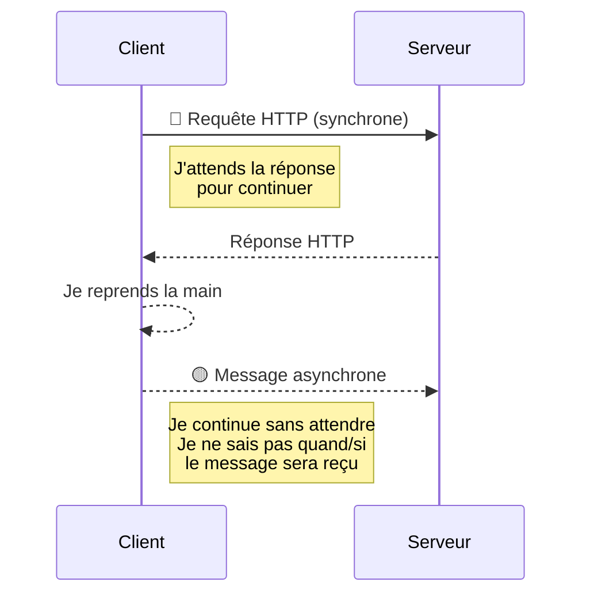

# Diagrammes de Séquence — SAI (Système Agricole Intelligent)

## 📖 Qu'est-ce qu'un diagramme de séquence ?

Un diagramme de séquence est un diagramme UML qui montre **comment les objets interagissent dans le temps**.

> **"Qui envoie quoi, à qui, dans quel ordre ?"**

Chaque composant du système devient une **ligne de vie** (lifeline) verticale, et les échanges sont des **flèches horizontales** de l'émetteur vers le récepteur.

---

## 📐 Notation utilisée

### Types de flèches

| Type | Flèche | Sens | Exemple dans notre projet | Signification |
|------|--------|------|---------------------------|---------------|
| **Synchrone** | `->>` pleine | Émetteur → Récepteur | `Web->>API: POST /api/...` | Le Web envoie la requête et **attend** la réponse (HTTP) |
| **Retour / Réponse** | `-->>` pointillés | Récepteur → Émetteur | `API-->>Web: HTTP 200` | Réponse à un appel synchrone |
| **Asynchrone** | `-->>` pointillés | Émetteur → Récepteur | `API-->>MQTT: Publier message` | Envoi **sans attente** de réponse (MQTT) |
| **Interne** | `->>` vers soi-même | `API->>API: Vérifier JWT` | Action interne au composant |

### Éléments de structure

| Élément | Syntaxe Mermaid | Utilité |
|---------|----------------|---------|
| Participant | `participant "Nom" as P` | Déclare une ligne de vie |
| Note | `Note over A,B: texte` | Ajoute un commentaire contextuel |
| Boucle | `loop [condition] ... end` | Action répétitive (ex: toutes les 5 min) |
| Condition | `alt [condition] ... else ... end` | Branchement si/sinon |
| Option | `opt [condition] ... end` | Bloc optionnel |

### Rappel : Synchrone vs Asynchrone



- **Synchrone** = Appel téléphonique (tu parles, l'autre répond, la communication est directe)
- **Asynchrone** = SMS (tu envoies un message, tu continues ta vie, l'autre répond quand il peut)

---

## 📋 Liste des scénarios

| # | Scénario | Cas d'utilisation | Acteur principal | Statut |
|---|----------|-------------------|------------------|--------|
| **1** | Irrigation automatique | UC6 : Règles d'automatisation | Horloge Système | ✅ Fichiers mis à jour dans `scenario_1/` |
| **2** | Commande manuelle depuis le Web | UC4 : Commander actionneur (web) | Agriculteur | ✅ Fichiers créés dans `scenario_2/` |
| **3** | Commande manuelle depuis le CLI | UC5 : Commander actionneur (CLI) | Agriculteur | ✅ Fichiers créés dans `scenario_3/` |
| **4** | Authentification | UC1 : S'authentifier | Agriculteur | ✅ Fichiers créés dans `scenario_4/` |
| **5** | Collecte de données capteurs | UC9 : Collecter données | ESP32 | ✅ Fichiers créés dans `scenario_5/` |
| **6** | Alerte critique | UC6_ext1 : Déclencher alerte | Système | ✅ Fichiers créés dans `scenario_6/` |

---

## 🏗️ Architecture générale des échanges

```
┌──────────────────────────────────────────────────────────────────┐
│                       FRONTEND (React)                          │
│  Pages : Login | Dashboard | Historique | Paramètres            │
│  │                                        ▲                     │
│  │ HTTP POST (requête)                    │ HTTP 200 (réponse)   │
│  ▼                                        │                     │
├──────────────────────────────────────────────────────────────────┤
│                       BACKEND (FastAPI)                         │
│  Routines : /api/auth, /api/mesures, /api/actionneurs, /api/logs│
│  Moteur d'automatisation (timer)                                │
│  │                                        ▲                     │
│  │ SQL (requêtes)                         │ Résultats           │
│  ▼                                        │                     │
├──────────────────────────────────────────────────────────────────┤
│                       BASE DE DONNÉES (PostgreSQL)              │
│  Tables : users, capteurs, mesures, actions, alertes, seuils    │
├──────────────────────────────────────────────────────────────────┤
│  │                                        ▲                     │
│  │ MQTT publish (publier)                 │ MQTT subscribe      │
│  ▼                                        │                     │
├──────────────────────────────────────────────────────────────────┤
│                       BROKER MQTT (Mosquitto)                   │
│  Topics : sai/parcelle1/capteurs/mesures                        │
│           sai/parcelle1/actionneurs/{type}/cmd                  │
│           sai/parcelle1/actionneurs/status                      │
│           sai/parcelle1/alertes                                 │
├──────────────────────────────────────────────────────────────────┤
│  │                                        ▲                     │
│  │ MQTT subscribe                         │ MQTT publish        │
│  ▼                                        │                     │
├──────────────────────────────────────────────────────────────────┤
│                       ESP32 (Microcontrôleur)                   │
│  Firmware : Lecture capteurs + Exécution commandes + Mode local │
│  │                                        ▲                     │
│  │ GPIO (lecture)                         │ GPIO (commande)     │
│  ▼                                        │                     │
├──────────────────────────────────────────────────────────────────┤
│               CAPTEURS / ACTIONNEURS (matériel)                 │
│  YL-69 | DHT22 | BH1750 | SEN0159 | Niveau eau                 │
│  Pompe | Ventilation | Éclairage                                │
└──────────────────────────────────────────────────────────────────┘
```

### Types d'échanges entre couches

| De | Vers | Protocole | Type | Détails |
|----|------|-----------|------|---------|
| Web | Backend | HTTP/REST | Synchrone | L'utilisateur attend une réponse (dashboard, commande) |
| Backend | BD | SQL (async) | Synchrone | Le backend interroge la BD et attend les résultats |
| Backend | Broker MQTT | MQTT publish | Asynchrone | Le backend publie une commande et continue |
| ESP32 | Broker MQTT | MQTT publish | Asynchrone | L'ESP32 envoie ses mesures et continue |
| Broker | ESP32 | MQTT subscribe | Asynchrone | L'ESP32 reçoit la commande quand elle arrive |
| Broker | Backend | MQTT subscribe | Asynchrone | Le backend reçoit les statuts/alertes |
| ESP32 | Actionneur | GPIO | Synchrone | Activation électrique directe |
| Capteur | ESP32 | GPIO/ADC/I2C | Synchrone | Lecture directe de la valeur |

---

## 🔗 Accès aux scénarios détaillés

| Scénario | Dossier | Contenu |
|----------|---------|---------|
| **1 - Irrigation automatique** | [`./scenario_1/`](./scenario_1/) | Scénario décrit + code Mermaid (3 phases : détection, exécution, arrêt) |
| **2 - Commande manuelle Web** | [`./scenario_2/`](./scenario_2/) | Scénario décrit + code Mermaid + exports |
| **3 - Commande manuelle CLI** | [`./scenario_3/`](./scenario_3/) | Scénario décrit + code Mermaid |
| **4 - Authentification** | [`./scenario_4/`](./scenario_4/) | Scénario décrit + code Mermaid (avec 3 cas : succès, champs invalides, identifiants incorrects) |
| **5 - Collecte données capteurs** | [`./scenario_5/`](./scenario_5/) | Scénario décrit + code Mermaid (boucle avec 5 capteurs) |
| **6 - Alerte critique** | [`./scenario_6/`](./scenario_6/) | Scénario décrit + code Mermaid (alerte CO₂, action auto + notification dashboard) |

---

## ✅ Règles à respecter pour tous les scénarios

1. **Toujours préciser le protocole** utilisé (HTTP, MQTT, SQL) dans les notes
2. **Toujours inclure les retours** : une flèche aller sans retour est incomplète
3. **MQTT est toujours asynchrone** : flèche en pointillés `-->>`
4. **HTTP est synchrone** : flèche pleine aller `->>`, flèche pointillés retour `-->>`
5. **Les actions internes** (validation, GPIO) sont des flèches vers soi-même
6. **Les durées et temporisations** sont notées avec `Note over`
7. **Les topics MQTT** suivent la convention `sai/parcelle1/{type}/{sous-type}`
