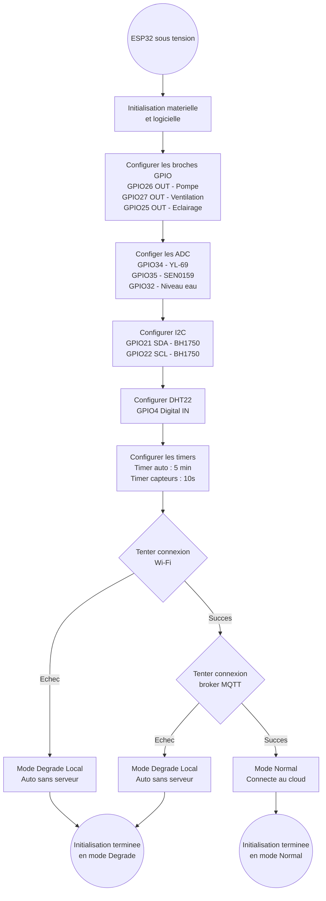

# Diagramme d'Activité — Phase 1 : Initialisation de l'ESP32

### Légende des modes

| Mode | Connexion | Comportement |
|------|-----------|--------------|
| **Normal** | Wi-Fi ✅ + MQTT ✅ | L'ESP32 communique avec le backend, reçoit les commandes, publie les mesures |
| **Dégradé Local** | Wi-Fi ❌ ou MQTT ❌ | L'ESP32 exécute seul l'automatisation avec les seuils par défaut, tente de se reconnecter à chaque cycle |

### Flux alternatifs possibles

1. **Échec matériel** : Si un capteur critique (ex: DHT22) ne répond pas à l'initialisation, l'ESP32 peut soit :
   - Ignorer le capteur et continuer (mode dégradé partiel)
   - Ou bloquer le démarrage (selon la configuration firmware)
2. **Reconnexion** : Si le mode Dégradé est actif, l'ESP32 tente une reconnexion à chaque cycle de la boucle d'automatisation
