# Diagramme d'Activité — Phase 2 : Boucle d'Automatisation

```mermaid
graph TD
    %% Style
    classDef phase fill:#e1f5fe,stroke:#0288d1,stroke-width:2px
    classDef action fill:#fff3e0,stroke:#f57c00
    classDef decision fill:#f3e5f5,stroke:#7b1fa2
    classDef securite fill:#ffebee,stroke:#c62828
    classDef parallel fill:#e8f5e9,stroke:#2e7d32

    %% Entrée
    Entree((Entree depuis<br/>Phase 1))

    %% Boucle principale
    Entree --> Boucle

    Boucle[Boucle automatisation<br/>toutes les 5 min]
    Boucle --> LireCapteurs

    %% Étape 1 : Lecture des capteurs
    LireCapteurs[Lire les 5 capteurs]
    LireDHT[Lire DHT22<br/>GPIO4 - Temperature + Humidite air]
    LireYL[Lire YL-69<br/>GPIO34 - Humidite sol]
    LireBH[Lire BH1750<br/>GPIO21-22 I2C - Luminosite]
    LireSEN[Lire SEN0159<br/>GPIO35 - CO2]
    LireNiv[Lire niveau eau<br/>GPIO32 - Niveau reservoir]

    LireCapteurs --> LireDHT
    LireDHT --> LireYL
    LireYL --> LireBH
    LireBH --> LireSEN
    LireSEN --> LireNiv

    %% Étape 2 : Publication MQTT
    LireNiv --> PubMQTT{Publier mesures<br/>sur MQTT ?}

    PubMQTT -->|Mode Normal| Publier[Publier sur MQTT<br/>sai/parcelle1/capteurs/mesures]
    PubMQTT -->|Mode Degrade| SkipPub[Publier en local<br/>Memoire interne ESP32]

    Publier --> Irrig
    SkipPub --> Irrig

    %% ═══════════════════════════════════════════════
    %% SOUS-PROCESSUS : IRRIGATION
    %% ═══════════════════════════════════════════════
    Irrig{Irrigation necessaire ?}

    Irrig -->|Humidite basse<br/>et pompe inactive| Reserv{Verifier reservoir}
    Irrig -->|Non| CheckStopPompe{Verifier si<br/>arret pompe}

    Reserv -->|Reservoir plein<br/>niveau superieur a 10%| PompeON[Activer pompe<br/>GPIO26 HIGH]
    Reserv -->|Reservoir vide<br/>niveau inferieur ou egal a 10%| AlertReserv[Alerte reservoir vide<br/>Pas d irrigation possible]

    CheckStopPompe -->|Humidite haute<br/>et pompe active| PompeOFF[Desactiver pompe<br/>GPIO26 LOW]
    CheckStopPompe -->|Non| ApresIrrig

    PompeON --> ApresIrrig
    AlertReserv --> ApresIrrig
    PompeOFF --> ApresIrrig

    %% ═══════════════════════════════════════════════
    %% ACTIONS PARALLELES : NOTIFICATIONS
    %% ═══════════════════════════════════════════════
    ApresIrrig[Notifications et enregistrement]
    ApresIrrig ==> NotifWeb[Notification dashboard<br/>via WebSocket]
    ApresIrrig ==> NotifBD[Mise a jour BD<br/>statut action]

    NotifWeb --> ApresVentil
    NotifBD --> ApresVentil

    %% ═══════════════════════════════════════════════
    %% SOUS-PROCESSUS : VENTILATION
    %% ═══════════════════════════════════════════════
    ApresVentil --> Ventil{Ventilation necessaire ?}

    Ventil -->|Temperature elevee<br/>superieure a 35C| VentilON[Activer ventilation<br/>GPIO27 HIGH]
    Ventil -->|CO2 eleve<br/>superieur a 1000 ppm| VentilON
    Ventil -->|Non| CheckStopVentil{Verifier si<br/>arret ventilation}

    CheckStopVentil -->|Temp et CO2 normaux<br/>temp inferieure a 30C et CO2 inferieur a 800 ppm| VentilOFF[Desactiver ventilation<br/>GPIO27 LOW]
    CheckStopVentil -->|Non| ApresVentil2

    VentilON --> ApresVentil2
    VentilOFF --> ApresVentil2

    ApresVentil2 --> Lumi

    %% ═══════════════════════════════════════════════
    %% SOUS-PROCESSUS : ECLAIRAGE
    %% ═══════════════════════════════════════════════
    Lumi{Eclairage necessaire ?}

    Lumi -->|Luminosite faible<br/>inferieure a 200 lux depuis 1h| LumiON[Allumer eclairage<br/>GPIO25 HIGH]
    Lumi -->|Non| ApresLumi
    LumiON --> ApresLumi

    %% ═══════════════════════════════════════════════
    %% VERIFICATIONS DE SECURITE (parallèle)
    %% ═══════════════════════════════════════════════
    ApresLumi ==> Sec1[Surveiller niveau d eau]
    ApresLumi ==> Sec2[Surveiller connexion reseau]

    %% Sécurité 1 : Niveau d'eau
    Sec1 -->|Niveau critique<br/>inferieur a 5%| AlertCrit[Alerte critique<br/>Notification dashboard]
    Sec1 -->|Niveau ok<br/>superieur ou egal a 5%| AllerTimer
    AlertCrit --> AllerTimer

    %% Sécurité 2 : Connexion
    Sec2 -->|OK| AllerTimer
    Sec2 -->|Perte detectee| Reconnex{Tenter reconnexion<br/>Wi-Fi + MQTT}

    Reconnex -->|Succes| RetourNorm[Changer mode<br/>Normal]
    Reconnex -->|Echec| ResterDeg[Rester en<br/>mode Degrade]

    RetourNorm --> AllerTimer
    ResterDeg --> AllerTimer

    %% Retour boucle
    AllerTimer --> Timer[Attente 5 minutes]
    Timer --> Boucle

    %% Sortie possible
    Boucle -.->|Interruption| Sortie((Sortie vers<br/>Phase 3))
```

### Logique de décision détaillée

#### Irrigation
| Condition | Action |
|-----------|--------|
| Humidité sol < 30% ET pompe inactive | Vérifier réservoir |
| Niveau réservoir > 10% | Activer pompe (GPIO26 HIGH) |
| Niveau réservoir ≤ 10% | Alerte réservoir vide |
| Humidité sol > 50% ET pompe active | Désactiver pompe (GPIO26 LOW) |

#### Ventilation
| Condition | Action |
|-----------|--------|
| Température > 35°C | Activer ventilation (GPIO27 HIGH) |
| CO₂ > 1000 ppm | Activer ventilation (GPIO27 HIGH) |
| Température < 30°C ET CO₂ < 800 ppm | Désactiver ventilation (GPIO27 LOW) |

#### Éclairage
| Condition | Action |
|-----------|--------|
| Luminosité < 200 lux depuis plus d'1h | Allumer éclairage (GPIO25 HIGH) |

#### Sécurité
| Condition | Action |
|-----------|--------|
| Niveau eau < 5% | Alerte critique (notification dashboard) |
| Perte connexion réseau | Tentative reconnexion |
| Reconnexion réussie | Retour mode Normal |
| Reconnexion échouée | Rester en mode Dégradé |

### Notes sur l'hystérésis

L'écart entre seuil de déclenchement et seuil d'arrêt est volontaire :

- **Irrigation** : Déclenchement à 30%, arrêt à 50% → écart de 20%
- **Ventilation** : Déclenchement à 35°C, arrêt à 30°C → écart de 5°C
- **Éclairage** : Déclenchement après 1h sous 200 lux (pas de hystérésis mais délai temporel)

Ce mécanisme évite les **cycles courts** (marche/arrêt en boucle) quand les valeurs fluctuent autour d'un seuil unique.
