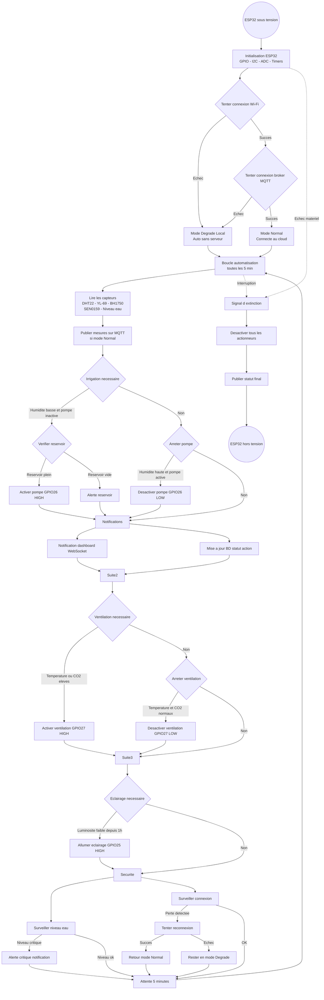

# Diagramme d'Activité — Cycle de vie complet de l'ESP32 (SAI)

```mermaid
graph TD
    %% Style
    classDef phase fill:#e1f5fe,stroke:#0288d1,stroke-width:2px
    classDef action fill:#fff3e0,stroke:#f57c00
    classDef decision fill:#f3e5f5,stroke:#7b1fa2
    classDef securite fill:#ffebee,stroke:#c62828

    %% PHASE 1 : INITIALISATION
    Debut((ESP32 sous tension))
    Init[Initialisation ESP32<br/>GPIO - I2C - ADC - Timers]
    WiFi{Tenter connexion Wi-Fi}
    MQTT{Tenter connexion broker MQTT}
    ModeDegrade[Mode Degrade Local<br/>Auto sans serveur]
    ModeNormal[Mode Normal<br/>Connecte au cloud]

    Debut --> Init
    Init --> WiFi
    WiFi -->|Echec| ModeDegrade
    WiFi -->|Succes| MQTT
    MQTT -->|Echec| ModeDegrade
    MQTT -->|Succes| ModeNormal

    %% PHASE 2 : BOUCLE AUTOMATISATION
    ModeNormal --> Boucle
    ModeDegrade --> Boucle

    Boucle[Boucle automatisation<br/>toutes les 5 min]

    LireCapteurs[Lire les capteurs<br/>DHT22 - YL-69 - BH1750<br/>SEN0159 - Niveau eau]
    PublierMesures[Publier mesures sur MQTT<br/>si mode Normal]

    Boucle --> LireCapteurs
    LireCapteurs --> PublierMesures

    PublierMesures --> Irrig{Irrigation necessaire}

    Irrig -->|Humidite basse et pompe inactive| Reserv{Verifier reservoir}
    Irrig -->|Non| StopPompeC{Arreter pompe}

    Reserv -->|Reservoir plein| PompeON[Activer pompe GPIO26 HIGH]
    Reserv -->|Reservoir vide| AlertNiv[Alerte reservoir]

    StopPompeC -->|Humidite haute et pompe active| PompeOFF[Desactiver pompe GPIO26 LOW]
    StopPompeC -->|Non| Suite1

    PompeON --> Suite1
    AlertNiv --> Suite1
    PompeOFF --> Suite1

    Suite1[Notifications]
    Suite1 --> Notif1[Notification dashboard WebSocket]
    Suite1 --> Notif2[Mise a jour BD statut action]
    Notif1 --> Suite2
    Notif2 --> Suite2

    Suite2 --> Ventil{Ventilation necessaire}

    Ventil -->|Temperature ou CO2 eleves| VentilON[Activer ventilation GPIO27 HIGH]
    Ventil -->|Non| StopVentilC{Arreter ventilation}

    StopVentilC -->|Temperature et CO2 normaux| VentilOFF[Desactiver ventilation GPIO27 LOW]
    StopVentilC -->|Non| Suite3

    VentilON --> Suite3
    VentilOFF --> Suite3

    Suite3 --> Lumi{Eclairage necessaire}

    Lumi -->|Luminosite faible depuis 1h| LumiON[Allumer eclairage GPIO25 HIGH]
    Lumi -->|Non| Suite4
    LumiON --> Suite4

    Suite4[Securite]
    Suite4 --> Sec1[Surveiller niveau eau]
    Suite4 --> Sec2[Surveiller connexion]

    Sec1 -->|Niveau critique| AlertCrit[Alerte critique notification]
    Sec1 -->|Niveau ok| Timer
    AlertCrit --> Timer

    Sec2 -->|Perte detectee| Reconnex[Tenter reconnexion]
    Sec2 -->|OK| Timer

    Reconnex -->|Succes| RetourNorm[Retour mode Normal]
    Reconnex -->|Echec| ResteDeg[Rester en mode Degrade]
    RetourNorm --> Timer
    ResteDeg --> Timer

    Timer[Attente 5 minutes] --> Boucle

    %% PHASE 3 : EXTINCTION
    Boucle -.->|Interruption| Extinction
    Init -.->|Echec materiel| Extinction

    Extinction[Signal d extinction]
    StopAll[Desactiver tous les actionneurs]
    Fin((ESP32 hors tension))

    Extinction --> StopAll
    StopAll --> PubFinal[Publier statut final]
    PubFinal --> Fin
```
