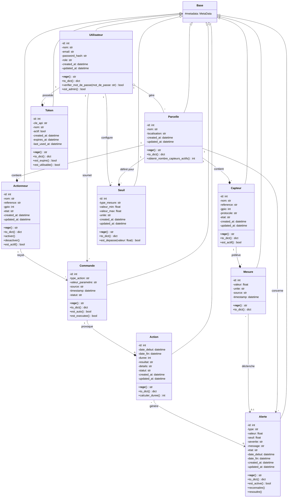

# Diagramme de Classes POO — SAI (Système Agricole Intelligent)

## 📖 Qu'est-ce qu'un diagramme de classes ?

Le diagramme de classes est le **diagramme le plus technique d'UML**. Il montre la **structure statique** du code : quelles sont les classes, leurs attributs, leurs méthodes, et comment elles sont liées.

> **MLD** = "Comment stocker en tables SQL ?"
> **Diagramme de classes** = "Comment manipuler en Python (SQLAlchemy) ?"

### Différence avec le MCD/MLD

| MCD (conceptuel) | MLD (logique) | Diagramme de classes (POO) |
|-----------------|---------------|---------------------------|
| Entités + relations | Tables + FK + types SQL | Classes + associations + types Python |
| `UTILISATEUR` | `utilisateurs(id, nom, email...)` | `class Utilisateur(Base):` |
| Cardinalités (1,1) (0,N) | NOT NULL, FK | `relationship()` + multiplicités |
| Pas de technique | SERIAL, VARCHAR, CHECK | int, str, Column(...) |

---

## 📐 Rappel : Notation UML des visibilités

| Symbole | Visibilité | Signification |
|---------|-----------|---------------|
| `-` | **Privé** | Attribut accessible uniquement depuis la classe elle-même |
| `+` | **Public** | Méthode accessible depuis n'importe où (l'interface de la classe) |
| `#` | **Protégé** | Accessible depuis la classe et ses enfants (héritage) |

**Règle UML** : Les **attributs** sont TOUJOURS `-` (privés). Les **méthodes** sont `+` (publiques). C'est **l'encapsulation** : on cache les données, on expose les comportements.

> ⚠️ En Python/SQLAlchemy, les attributs sont techniquement accessibles (pas de vrai privé), mais le diagramme UML suit la théorie.

---

## 🔗 Les 3 types de relations en diagramme de classes

| Type | Symbole Mermaid | Signification | Exemple concret |
|------|----------------|---------------|-----------------|
| **Association** | `-->` | Lien simple entre deux classes indépendantes | `Utilisateur` → `Commande` (l'utilisateur soumet des commandes, mais si l'utilisateur est supprimé, les commandes restent dans l'historique) |
| **Agrégation** | `o--` | Relation "a un" — la partie **peut exister sans le tout** (losange vide du côté du tout) | `Utilisateur` ◇→ `Parcelle` (si l'utilisateur est supprimé, ses parcelles sont **réassignées**, pas supprimées) |
| **Composition** | `--*` | Relation "est composé de" — la partie **ne peut PAS exister sans le tout** (losange plein du côté du tout) | `Capteur` ◆→ `Mesure` (si le capteur est supprimé, **toutes ses mesures sont supprimées** avec lui) |

### Règle pour choisir

```
Si je supprime la classe A, est-ce que la classe B doit être supprimée aussi ?
→ OUI et B n'a pas de sens sans A     → Composition ◆
→ NON, B peut être réassignée          → Agrégation ◇
→ NON, B continue sa vie               → Association simple
```

---

## 🖼️ Diagramme complet (Mermaid)



---

## 🧠 Explication des méthodes métier

### Méthodes communes à toutes les classes

| Méthode | Utilité |
|---------|---------|
| `__repr__()` | Représentation lisible pour le débogage (logs, console) |
| `to_dict()` | Convertit l'objet en dictionnaire JSON pour l'API REST |

### Méthodes spécifiques

| Classe | Méthode | Logique |
|--------|---------|---------|
| **Utilisateur** | `verifier_mot_de_passe()` | Compare le hash stocké avec le mot de passe fourni (bcrypt) |
| **Utilisateur** | `est_admin()` | Retourne `True` si rôle = `'admin'` |
| **Parcelle** | `obtenir_nombre_capteurs_actifs()` | Compte les capteurs dont l'état est `'actif'` |
| **Capteur** | `est_actif()` | Retourne `True` si état = `'actif'` |
| **Actionneur** | `activer()` | Passe l'état à `'actif'` et notifie le changement |
| **Actionneur** | `desactiver()` | Passe l'état à `'inactif'` et notifie le changement |
| **Actionneur** | `est_actif()` | Retourne `True` si état = `'actif'` |
| **Commande** | `est_auto()` | Retourne `True` si source = `'auto'` (automatisation) |
| **Commande** | `est_executee()` | Retourne `True` si statut = `'executee'` |
| **Action** | `calculer_duree()` | Calcule la durée entre `date_debut` et `date_fin` |
| **Alerte** | `est_active()` | Retourne `True` si état = `'active'` |
| **Alerte** | `reconnaitre()` | Passe l'état à `'reconnue'` (l'utilisateur a vu l'alerte) |
| **Alerte** | `resoudre()` | Passe l'état à `'resolue'` et fixe `date_fin` |
| **Seuil** | `est_depasse(valeur)` | Vérifie si `valeur` est en dehors de l'intervalle `[valeur_min, valeur_max]` |
| **Token** | `est_expire()` | Vérifie si la date d'expiration est dépassée |
| **Token** | `est_utilisable()` | Retourne `True` si actif ET non expiré |

---

## 🔗 Détail des 13 relations

### Relations d'héritage (toutes les classes)

Toutes les classes héritent de `Base` (SQLAlchemy), ce qui leur donne :
- La capacité à être **persistées** en base de données
- L'accès à la **session** SQLAlchemy
- Les **métadonnées** de colonnes

### Associations métier

| # | Type | Classe A | Mult. | Verbe | Classe B | Mult. | FK dans | Justification du type |
|---|------|----------|-------|-------|----------|-------|---------|----------------------|
| 1 | ◇ Agrégation | **Utilisateur** | 1 | gère | **Parcelle** | 0..\* | `parcelles.id_utilisateur` | Une parcelle peut être réassignée si l'utilisateur est supprimé |
| 2 | → Association | **Utilisateur** | 1 | soumet | **Commande** | 0..\* | `commandes.id_utilisateur` (NULLABLE) | Les commandes restent dans l'historique |
| 3 | ◆ Composition | **Utilisateur** | 1 | possède | **Token** | 0..\* | `tokens.id_utilisateur` | Un token n'a aucun sens sans utilisateur |
| 4 | → Association | **Utilisateur** | 1 | configure | **Seuil** | 0..\* | `seuils.id_utilisateur` | L'utilisateur a CONFIGURÉ mais ne possède pas le seuil (c'est la parcelle qui le possède) |
| 5 | ◆ Composition | **Parcelle** | 1 | contient | **Capteur** | 0..\* | `capteurs.id_parcelle` | Un capteur sans parcelle n'existe pas |
| 6 | ◆ Composition | **Parcelle** | 1 | contient | **Actionneur** | 0..\* | `actionneurs.id_parcelle` | Un actionneur sans parcelle n'existe pas |
| 7 | ◆ Composition | **Parcelle** | 1 | définit pour | **Seuil** | 0..\* | `seuils.id_parcelle` | Un seuil est défini POUR une parcelle spécifique |
| 8 | → Association | **Parcelle** | 1 | concerne | **Alerte** | 0..\* | `alertes.id_parcelle` | Les alertes restent dans l'historique |
| 9 | ◆ Composition | **Capteur** | 1 | prélève | **Mesure** | 0..\* | `mesures.id_capteur` | Une mesure sans capteur n'a aucun sens |
| 10 | → Association | **Mesure** | 0..\* | déclenche | **Alerte** | 0..1 | `alertes.id_mesure` (NULLABLE) | Lien temporaire, une alerte peut exister sans mesure |
| 11 | → Association | **Action** | 0..\* | génère | **Alerte** | 0..1 | `alertes.id_action` (NULLABLE) | Lien temporaire, une alerte peut exister sans action |
| 12 | → Association | **Actionneur** | 1 | reçoit | **Commande** | 0..\* | `commandes.id_actionneur` | Les commandes restent historisées |
| 13 | ◆ Composition | **Commande** | 1 | provoque | **Action** | 0..1 | `actions.id_commande` (UNIQUE) | Une action sans commande n'a aucun sens |

---

## 📊 Récapitulatif des types de relations

```
◆ COMPOSITION (5)                        ◇ AGRÉGATION (1)              → ASSOCIATION (7)
┌──────────────────────┐                ┌──────────────────────┐       ┌──────────────────────┐
│ Commande → Action    │                │ Utilisateur → Parc. │       │ Utilisateur → Cde   │
│ Capteur → Mesure     │                └──────────────────────┘       │ Utilisateur → Seuil │
│ Parcelle → Capteur   │                                              │ Parcelle → Alerte   │
│ Parcelle → Actionneur│                                              │ Mesure → Alerte     │
│ Parcelle → Seuil     │                                              │ Action → Alerte     │
│ Utilisateur → Token  │                                              │ Actionneur → Cde    │
└──────────────────────┘                                              └──────────────────────┘
```

### Note importante sur Utilisateur → Seuil

Tu as demandé pourquoi ce n'est pas une composition. Voici le raisonnement :

- **Un seuil a DEUX parents** : `Utilisateur` (qui l'a configuré) et `Parcelle` (pour qui il est défini)
- La **vraie dépendance forte** est avec **Parcelle** : si la parcelle est supprimée, le seuil n'a plus de sens
- L'utilisateur est **l'auteur** de la configuration, pas le **propriétaire** du seuil
- Donc : **Composition** avec Parcelle ◆, **simple association** avec Utilisateur →

---

## 📝 Cas particuliers à retenir

| Cas | Explication | Conséquence UML |
|-----|-------------|-----------------|
| `commandes.id_utilisateur` NULLABLE | Quand source = `'auto'`, pas d'humain | Multiplicité `0..*` côté Commande |
| `actions.id_commande` UNIQUE | 1 commande → 1 seule action | Multiplicité `0..1` côté Action |
| `alertes.id_mesure` / `id_action` NULLABLE | Une alerte a UNE source : mesure OU action | Deux relations → avec `0..1` |
| Mesure sans `created_at` | Volume élevé (~43 200 lignes/jour) | Pas d'attribut `created_at`/`updated_at` |
| Seuil a 2 parents | Configuré par Utilisateur + défini pour Parcelle | Composition avec Parcelle, simple association avec Utilisateur |

---

## ✅ Règles de validation

1. **Toute classe a une clé primaire** `id: int`
2. **Toute classe avec `created_at`/`updated_at`** sauf Mesure
3. **Les FK sont implicites** : ce sont les attributs `id_*` qui portent les clés étrangères
4. **Les relations sont bidirectionnelles** via `relationship()`
5. **Encapsulation respectée** : `-` attributs, `+` méthodes
6. **Types de relations justifiés** : chaque composition, agrégation ou association a une raison métier

---

## 📊 Traçabilité UC ↔ Classes

| UC | Intitulé | Classe(s) concernée(s) | Méthodes utilisées |
|----|----------|------------------------|--------------------|
| UC1 | S'authentifier | `Utilisateur`, `Token` | `verifier_mot_de_passe()`, `est_utilisable()` |
| UC2 | Consulter le tableau de bord | `Parcelle`, `Capteur`, `Mesure`, `Actionneur`, `Alerte` | `est_actif()`, `est_active()` |
| UC3 | Visualiser l'historique | `Mesure` | `to_dict()` |
| UC4 | Commander actionneur (web) | `Commande`, `Action`, `Actionneur` | `activer()`, `est_actif()` |
| UC5 | Commander actionneur (CLI) | `Token`, `Commande`, `Action` | `est_utilisable()` |
| UC6 | Exécuter automatisation | `Mesure`, `Seuil`, `Commande`, `Alerte` | `est_depasse()`, `est_auto()` |
| UC7 | Configurer les seuils | `Seuil` | CRUD |
| UC8 | Gérer les utilisateurs | `Utilisateur` | `est_admin()` |
| UC9 | Collecter données capteurs | `Capteur`, `Mesure` | `est_actif()` |
| UC10 | Recevoir et exécuter commande | `Actionneur`, `Commande`, `Action` | `activer()`, `desactiver()`, `calculer_duree()` |
| UC11 | Gérer la connexion réseau | *(aucune classe)* | Interne ESP32 |
| UC12 | **Gérer les capteurs** | **`Capteur`** | **CRUD + `est_actif()`** |
| UC13 | **Gérer les actionneurs** | **`Actionneur`** | **CRUD + `est_actif()`** |
| UC14 | **Gérer les parcelles** | **`Parcelle`** | **CRUD + `obtenir_nombre_capteurs_actifs()`** |

> **Aucune nouvelle classe ni méthode n'est nécessaire** pour UC12-14. Les classes `Capteur`, `Actionneur` et `Parcelle` existent déjà avec leurs méthodes métier.

---

## ➡️ Prochaine étape

Une fois ce diagramme validé, on écrira les 10 fichiers Python correspondants dans `backend/models/` avec SQLAlchemy.

---

*Document créé le 05/07/2026 — Projet SAI*
*Dernières mises à jour : visibilité UML corrigée, types de relations ajoutés (composition/agrégation/association), harmonisation UC12-14 (20/07/2026)*
