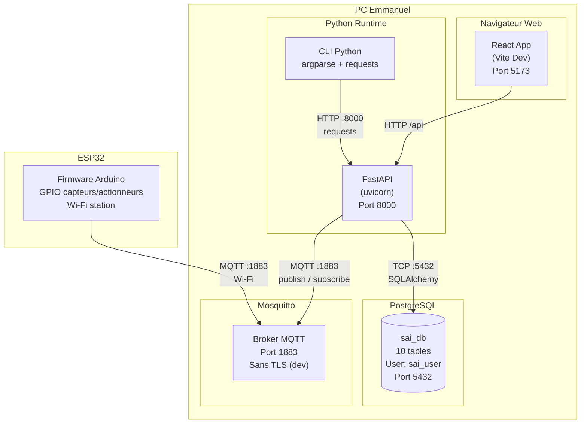

# Diagramme de Deploiement — Mode Local (Developpement)

## Introduction

Ce diagramme represente l'**etat actuel** du projet SAI : tous les composants tournent sur un seul poste de developpement (PC d'Emmanuel). C'est l'environnement de **developpement et de test** utilise pendant la phase de codage.

> **Question repondue** : *Ou tourne chaque composant du systeme pendant le developpement ?*

---

## Diagramme UML de Deploiement (Mermaid)



---

## Description des Nœuds

| Noeud | Type UML | Description | Port |
|-------|----------|-------------|------|
| **PC Emmanuel** | `<<device>>` | Poste de developpement, machine physique unique | — |
| **Navigateur Web** | `<<executionEnvironment>>` | Application React lancee par Vite en mode dev | 5173 |
| **Python Runtime** | `<<executionEnvironment>>` | Environnement Python avec FastAPI + uvicorn | 8000 |
| **CLI Python** | `<<executionEnvironment>>` | Interface en ligne de commande (argparse) | — |
| **PostgreSQL** | `<<executionEnvironment>>` | Base de donnees locale, user `sai_user` | 5432 |
| **Mosquitto** | `<<executionEnvironment>>` | Broker MQTT local, sans chiffrement | 1883 |
| **ESP32** | `<<device>>` | Microcontroleur physique connecte en Wi-Fi | GPIO |

---

## Flux de Donnees

| Source | Destination | Protocole | Port | Description |
|--------|-------------|-----------|------|-------------|
| Navigateur | FastAPI | HTTP | 5173 → 8000 | Proxy Vite redirige `/api` vers le backend |
| FastAPI | PostgreSQL | TCP | 5432 | SQLAlchemy connecte a `sai_user@sai_db` |
| FastAPI | Mosquitto | MQTT | 1883 | Subscribe aux topics commandes |
| ESP32 | Mosquitto | MQTT | 1883 | Publish mesures, subscribe commandes |
| CLI | FastAPI | HTTP | 8000 | Appels API REST via `requests` |

---

## Artefacts Logiciels

| Artefact | Technologie | Fichier d'entree | Role |
|----------|-------------|------------------|------|
| React App | React 19 + Vite 6 + Tailwind 4 | `frontend/src/main.jsx` | Interface utilisateur web |
| FastAPI | Python + FastAPI + SQLAlchemy | `backend/main.py` | API REST + logique metier |
| CLI | Python + argparse + requests | `Cli/main.py` | Interface terminal |
| sai_db | PostgreSQL 15+ | `Diagrammes/2.Merise_&_classe/MPD/mpd.sql` | 10 tables, FK, contraintes |
| Broker MQTT | Mosquitto | — | Messagerie entre ESP32 et backend |
| Firmware | Arduino/PlatformIO | `Iot/` (a venir) | Lecture capteurs + GPIO |

---

## Avantages du Mode Local

| Avantage | Description |
|----------|-------------|
| **Rapidite** | Pas de latence reseau, reponses instantanees |
| **Simplicite** | Pas de configuration TLS, Docker ou cloud |
| **Debug** | Acces direct aux logs, breakpoints possibles |
| **Offline** | Fonctionne sans connexion Internet (sauf ESP32 en Wi-Fi) |

## Limitations du Mode Local

| Limite | Description |
|--------|-------------|
| **Pas de deploiement** | Le systeme n'est accessible que sur le PC |
| **Pas de TLS** | MQTT en clair (port 1883), pas de chiffrement |
| **Pas de haute disponibilite** | Si le PC s'eteint, tout s'arrete |
| **Pas de scale** | Un seul utilisateur a la fois |
| **ESP32 depend du Wi-Fi** | Doit etre sur le meme reseau que le PC |

---

## Serveurs de Developpement

```bash
# Frontend (depuis frontend/)
npm run dev          # → http://localhost:5173

# Backend (depuis backend/)
python main.py       # → http://localhost:8000
# ou: uvicorn main:app --reload --port 8000

# MQTT (si installe localement)
mosquitto            # → localhost:1883

# Base de donnees
# PostgreSQL tourne en service local
# Port 5432, user sai_user, db sai_db
```

---

## Traçabilite UC ↔ Deploiement

| UC | Composant local | Noeud |
|----|-----------------|-------|
| UC1 S'authentifier | FastAPI + JWT | Python Runtime |
| UC2 Tableau de bord | React App + API | Navigateur + FastAPI |
| UC3 Historique | React App + API + BD | Navigateur + FastAPI + PostgreSQL |
| UC4 Commande Web | React App + FastAPI + MQTT | Navigateur + FastAPI + Mosquitto |
| UC5 Commande CLI | CLI + FastAPI + MQTT | CLI Python + FastAPI + Mosquitto |
| UC6 Automatisation | FastAPI (timer) + MQTT + BD | Python Runtime + Mosquitto + PostgreSQL |
| UC7 Config seuils | React App + FastAPI + BD | Navigateur + FastAPI + PostgreSQL |
| UC8 Gerer users | React App + FastAPI + BD | Navigateur + FastAPI + PostgreSQL |
| UC9 Collecte ESP32 | ESP32 + MQTT + FastAPI | ESP32 + Mosquitto + Python Runtime |
| UC10 Recevoir commande | ESP32 + MQTT | ESP32 + Mosquitto |
| UC11 Gestion reseau | ESP32 (Wi-Fi) | ESP32 |

---

*Mode local — Projet SAI — Emmanuel Gilwandji — Aout 2026*
